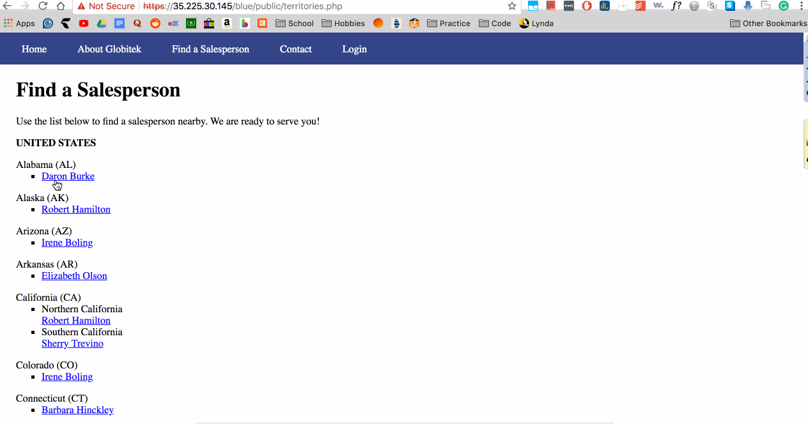
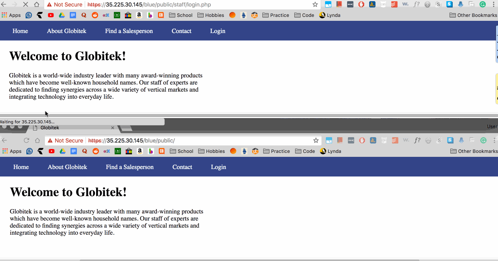
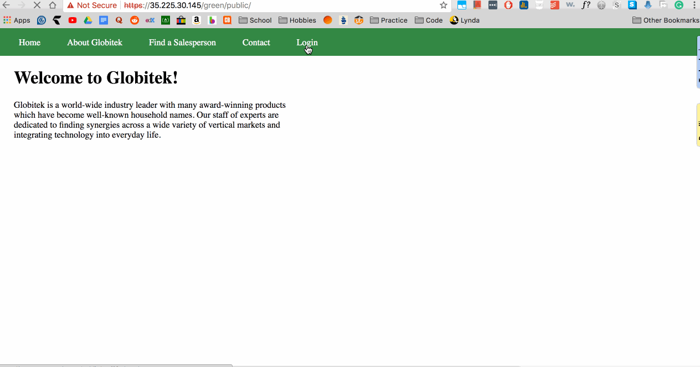
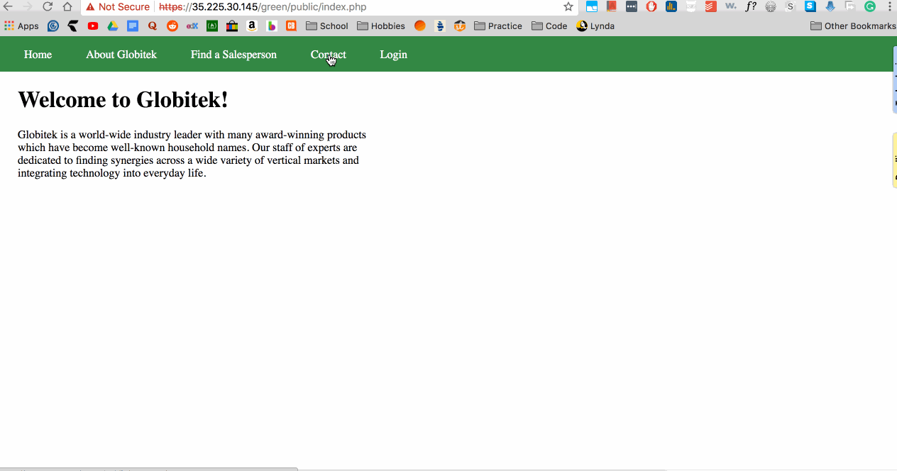
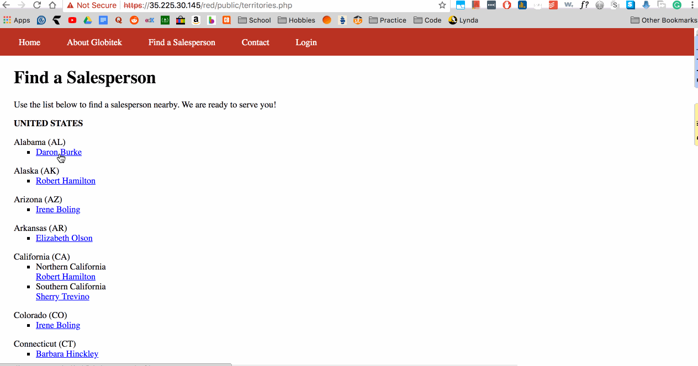
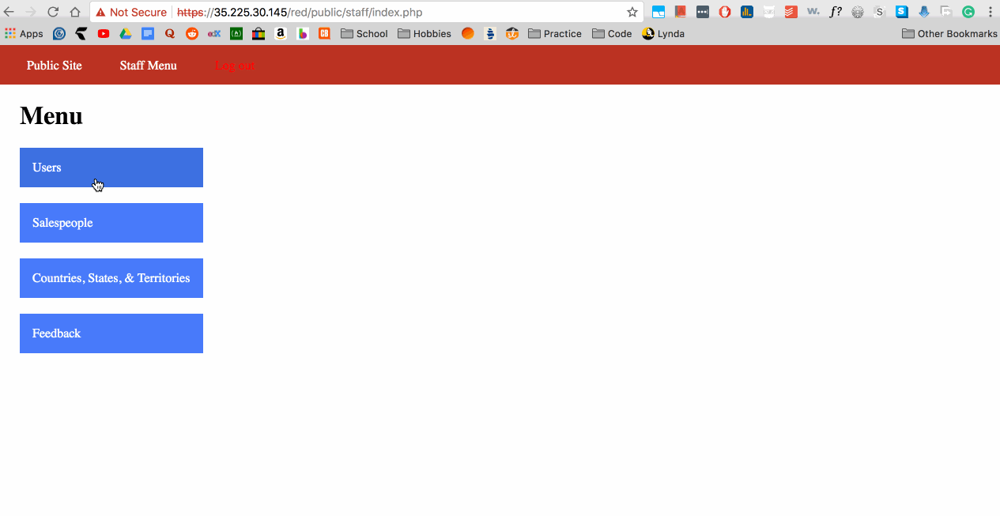
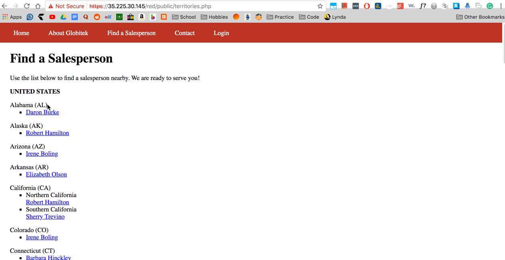
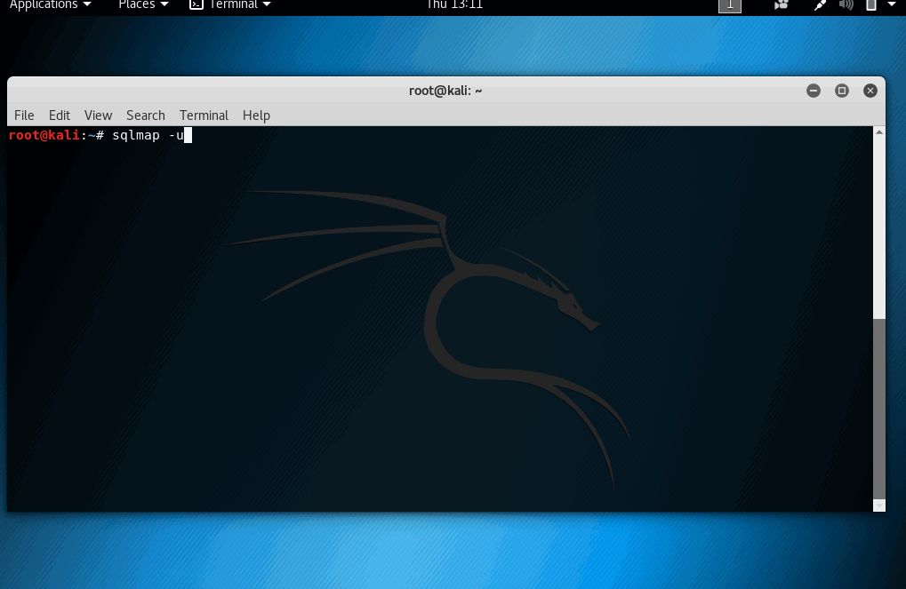
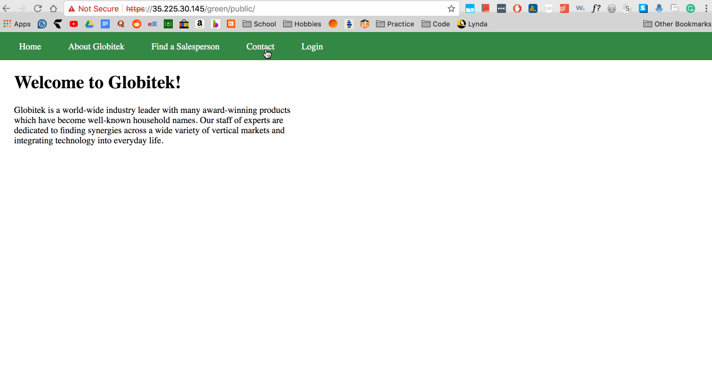

CodePath University's Web Security

# codepath_week8

Time spent: **5** hours

> Objective: Identify vulnerabilities in three different versions of the Globitek website: blue, green, and red.

The six possible exploits are:
* Username Enumeration
* Insecure Direct Object Reference (IDOR)
* SQL Injection (SQLi)
* Cross-Site Scripting (XSS)
* Cross-Site Request Forgery (CSRF)
* Session Hijacking/Fixation

Each version of the site has been given two of the six vulnerabilities. (In other words, all six of the exploits should be assignable to one of the sites.)

## Blue

- [x] Vulnerability #1: SQL Injection

#### Walkthrough
  1. Go to a saleperson profile (ex. /blue/public/staff/salespeople/show.php?id=1)
  2. After the link, inject SQL (‘ OR SLEEP(5)=0--‘)

- [x] Vulnerability #2: Session Hijacking/Fixation

#### Walkthrough
  1. An unknown user(attacker) changes the PHPSESSION of the site. (using: https://35.225.30.145/blue/public/hacktools/change_session_id.php)
  2. When admin is logged in, attacker is able to steal the session of the admin and can bypass logging in with username and password.

## Green

- [x] Vulnerability #1: User Enumeration

#### Walkthrough
  1. Login and type a username you know exists on the database and type a wrong password
  2. A username that exists on the database with a wrong password will be printed in bold
  3. But a username that does not exist with inputted wrong password will not be in bold

- [x] Vulnerability #2: Cross-Site Scripting (XSS)

#### Walkthrough
  1. Go to the Contact Form of the website and write a comment/feedback
  2. In the comment section, inject XSS script ()

## Red

- [x] Vulnerability #1: Insecure Direct Object Reference (IDOR)

#### Walkthrough
  1. When you check the list of salesperson on the site, there is an extension of an id parameter which is flawed and exploitable.
  2. Change the id parameter until you get a hidden/unknown/secret employee/salesperson (id=10, id=11)

Vulnerability #2: Cross-Site Request Forgery (CSRF)

#### Walkthrough 
  1. There is a vulnerability in the users section of Globitek Red
  2. Go to users page and inspect page source
  3. Create a new html file that takes the form and resubmits it without using the csrf token.
  4. Open the vulnerable html file and watch it change user information directly on the website.

#### Walkthrough (hidden iframe method)
  1. There is a vulnerability in the salesperson section of Globitek Red.
  2. Go to salesperson page and find a person to change identity and inspect page source
  3. Create a new html file that takes the form and resubmits it without using the csrf token.
  4. Write on Feedback Page with link to the vulnerable html file to let admin have access to the attack.
  4. Let admin open the file and watch admin change user information by clicking on the link.
  
# Bonus Objectives
## Bonus Objective 1 (SQL Injection)

#### Walkthrough
  1. Use sqlmap to access databases, list of tables, users, usernames, other database information and more
  2. In this demo, I showed information displayed on the database of users in Globitek Blue (The vulnerable site)

## Bonus Objective 2 (XSS Attack)

#### Walkthrough
  1. Write a feedback so that when admin presses and checks on it, while be vulnerable to XSS Attack that
    - a) direct the user to a new URL ``
    - b) read cookie data, ``
    - c) set cookie data. ``

